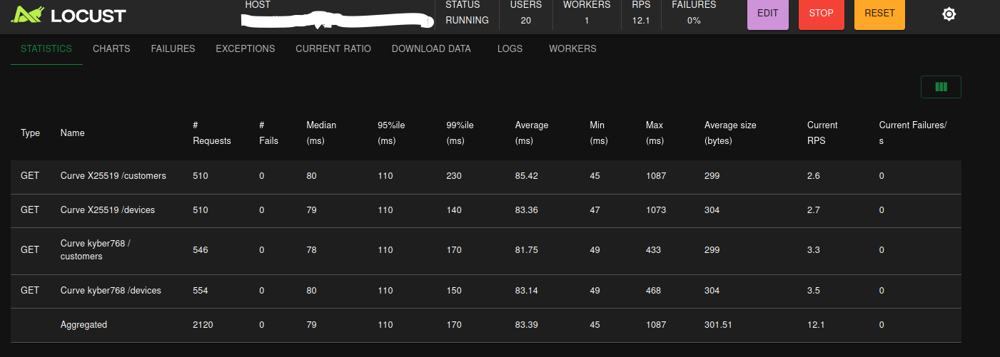
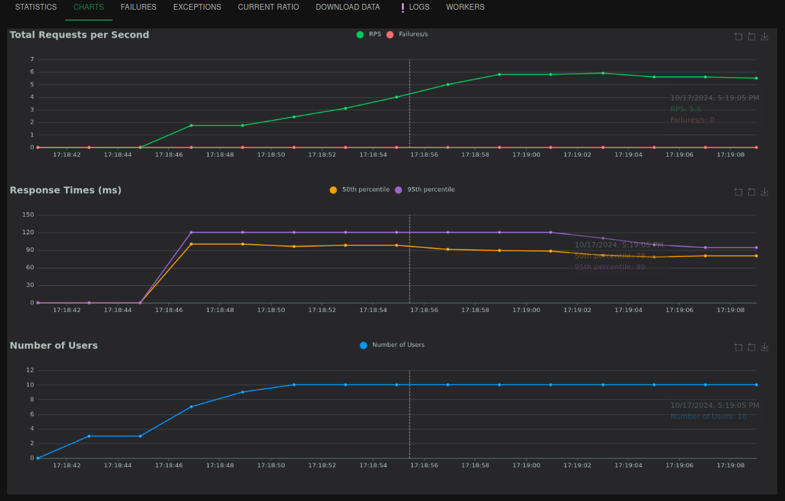

## Purpose 
This directory contains a Dockerfile that builds the [OpenSSL v3](https://github.com/openssl/openssl)  [OQS provider](https://github.com/open-quantum-safe/oqs-provider), and Python3 which allows locust to negotiate quantum-safe keys in TLS 1.3.

## Quick start
Assuming Docker is [installed](https://docs.docker.com/install) the following command

2) Run `docker build -t oqs-locust:0.0.1 .` to create a post quantum-enabled Locust docker image.
3) To verify all components perform quantum-safe operations, first start the container with docker compose `LOGGER_LEVEL=DEBUG HOST=https://qsc-nginx.discovery.hi.inet:4433 docker compose  up --scale master=1 --scale worker=8`.
4) Connect to the locust web interface at `http://localhost:8189` and start a load test.

By default, Locust supports all algorithms supported by the OQS openssl.

Some environments variables yo need to know
- LOGGER_LEVEL: Set the log level for the locust master and worker. Default is ERROR.
- HOST: Set the host to test. Default is https://test:4433
- WORKERS: Set the number of workers. Default is 8. Ideally, the number of workers should be the same as the number of cores in the machine.
- MASTER: Set the number of master. Default is 1.
- MASTER_PORT: Set the port for the master. Default is 8189.

In Locust web server, you need to set 2 variables:
- Number of users to simulate: The number of users to simulate that will hit the server.
- Hatch rate: The rate per second in which users are spawned.

After that, you can start the test:

STATISTICS


CHARTS


### HOW TO CREATE A PERFORMANCE TEST

Using Locust, you can configure a performance scenario. For this, you can use the following structure. Note: This is just a basic example, and the real implementation might use subprocess and openssl to handle post-quantum cryptographic curves, as in the actual locustfile.py.

```python
from locust import HttpUser, TaskSet, task, between
class UserBehavior(TaskSet):
    # on_start is called when a Locust starts, before any task is scheduled
    def on_start(self):
        self.index()
        self.about()

    # tasks is a list of tasks that a Locust will choose from to execute
    # tasks are chosen with the weighted_task_set attribute
    @task(1)
    def index(self):
        self.client.get("/")
        
    # in this case the about task is twice as likely to be chosen as the index task 
    @task(2)
    def about(self):
        self.client.get("/about/")

 
